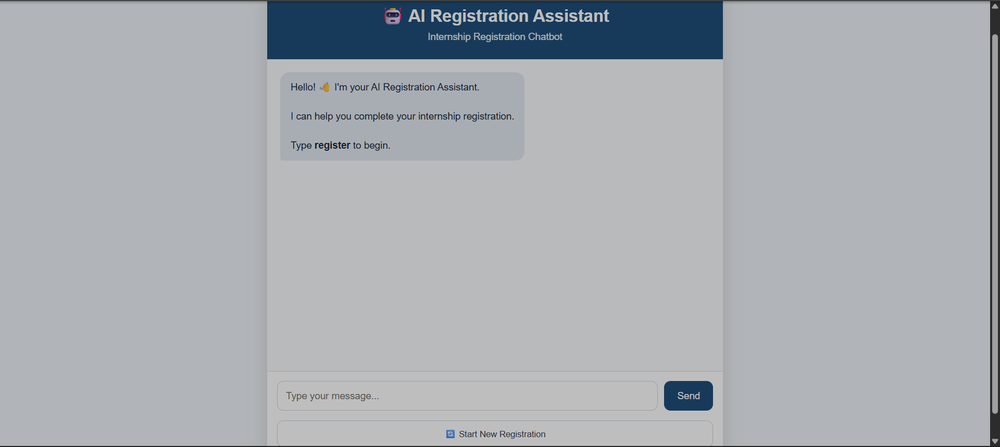
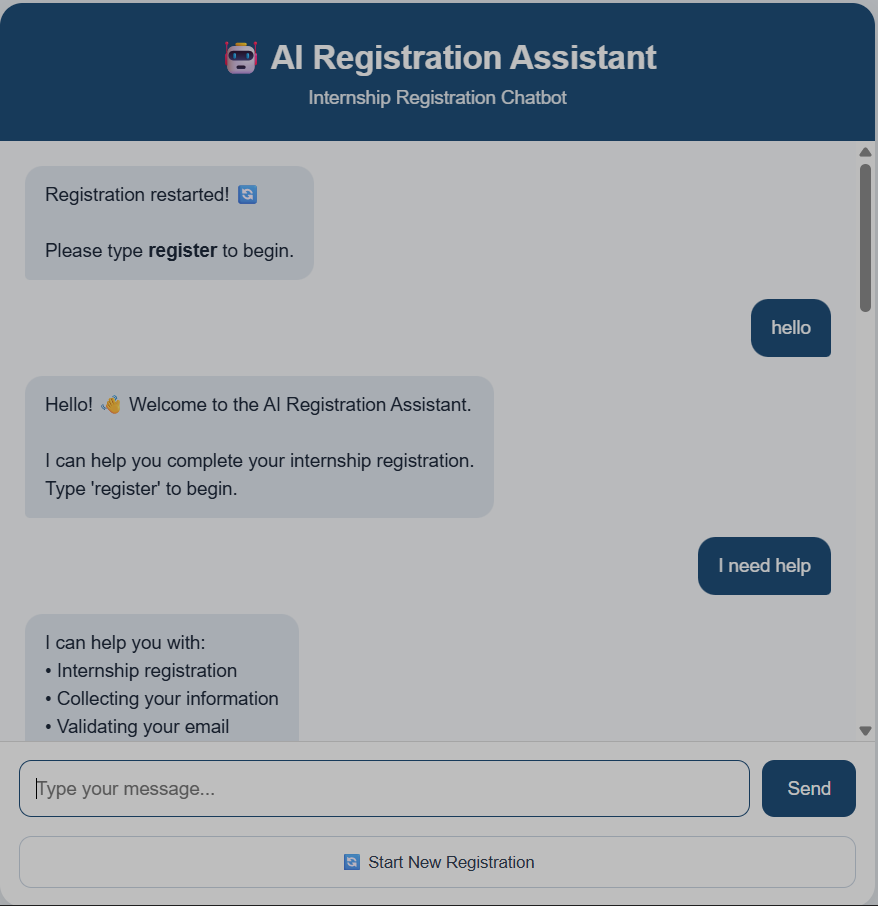
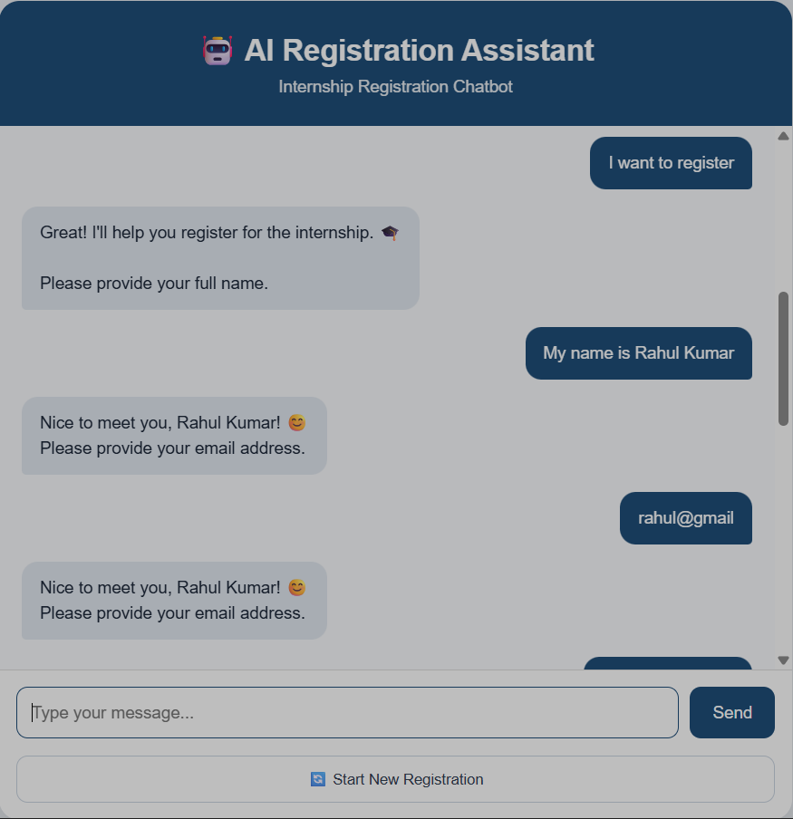
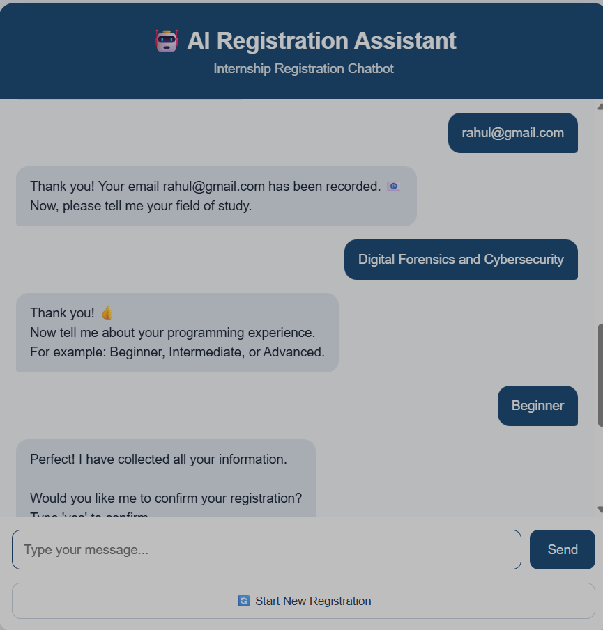
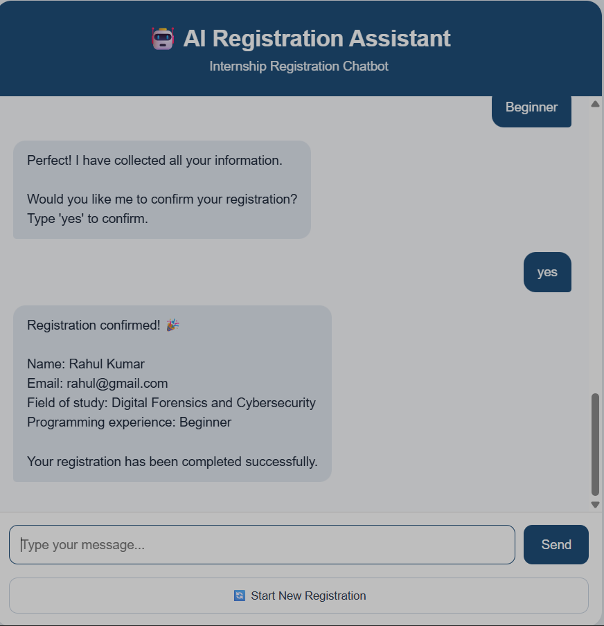

# 🤖 AI Registration Assistant

An AI-powered chatbot that helps users complete internship registration through a conversational interface.

---

## 📌 Features

- Interactive chatbot UI
- Step-by-step registration flow
- Name, email, and field collection
- Programming experience selection
- Registration confirmation system
- Restart registration option

---

## 🛠️ Technologies Used

- Python
- Flask
- NLTK
- Scikit-learn

---

## 📂 Project Structure

```
AI-Registration-Assistant/
│── app.py
│── registration_assistant.py
│── intent_classifier.py
│── intents.json
│── templates/
│    └── index.html
│── static/
│    └── style.css
│── README.md
```

---

## ▶️ How to Run

1. Install dependencies:
```
pip install flask nltk scikit-learn
```

2. Run the app:
```
python app.py
```

3. Open browser:
```
http://127.0.0.1:5000/
```

---

## 📸 Screenshots

### 🏠 Home Screen


### 📝 Registration Start


### 📧 User Details Input


### 📊 More Details


### ✅ Confirmation Step


### 🎉 Registration Completed


---

## 📌 Task Details

- **Task Name:** AI Registration Assistant  
- **Task ID:** AI-SS-001  
- **Type:** Internship Assignment  
- **Objective:** Build an AI chatbot for internship registration  

---

## 👨‍💻 Author

**Prasanna Tudu**
